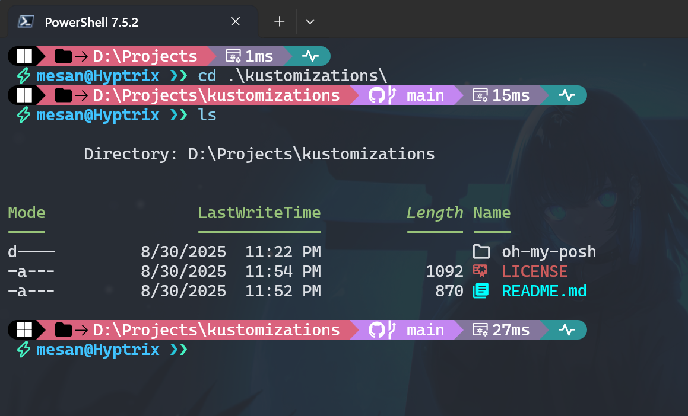

# Kustomizations 🛠️

> A collection of my personal customizations and configurations for various utilities and tools. Each configuration is tailored to my workflow and preferences.

### What's Here Right Now

🎨 **oh-my-posh**: "A prompt theme engine for any shell."\

- _custom modern theme inspired from `montys` and `jandedobbeleer`_
  

### Usage

Feel free to browse, fork, or use any of these configurations. If you find something useful, feel free to adapt it to your own needs!

### Contributing

While this is primarily my personal collection, I'm open to suggestions and improvements. Feel free to open an issue or submit a pull request if you have ideas for enhancements.

---

_This is my personal setup - nothing fancy, just keeping things organized and sharing what works for me._ ✨

@xandemon

